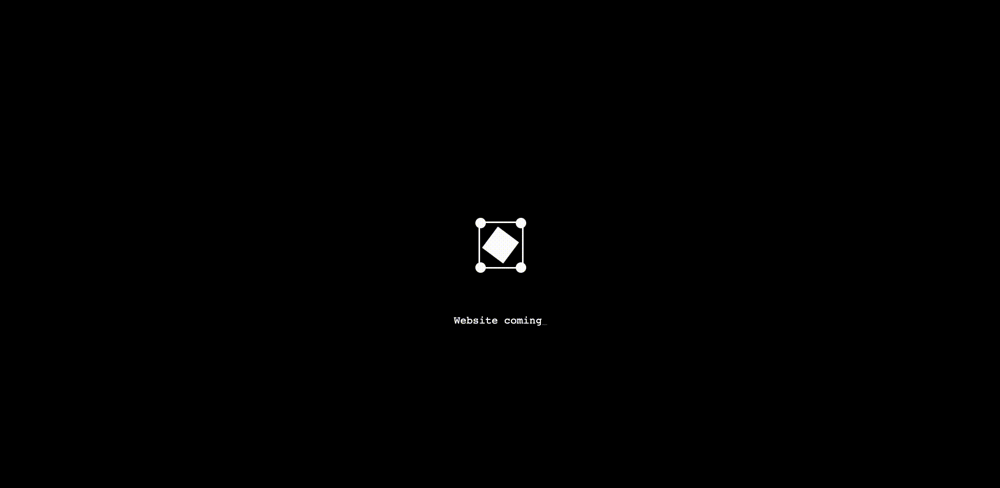

# Animation for waiting page - GSAP and React

It's a simple animation for waiting page. I use GSAP and React for create this one.  
For see the animation, go see [DEMO](https://www.qodall.com/)


## How install and run



For install this project in your computer you need to clone this repository.  
Use the package manager [npm](https://www.npmjs.com/) to install all dependencies.

```bash
npm i
npm run dev
#or 
yarn install
yarn dev
#or 
pnpm i
pnpm dev
```

⚠️ For use this project you need to have a [GSAP](https://greensock.com/gsap/) licence.

